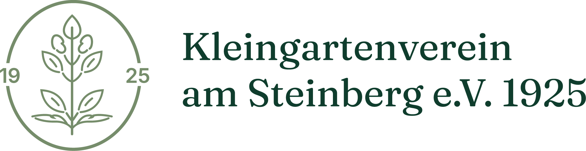
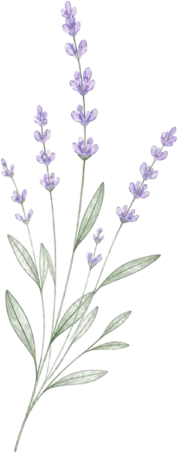
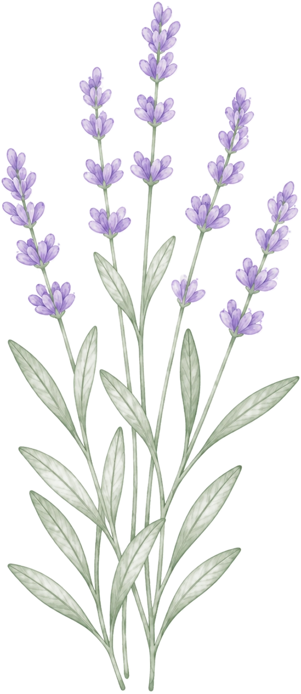
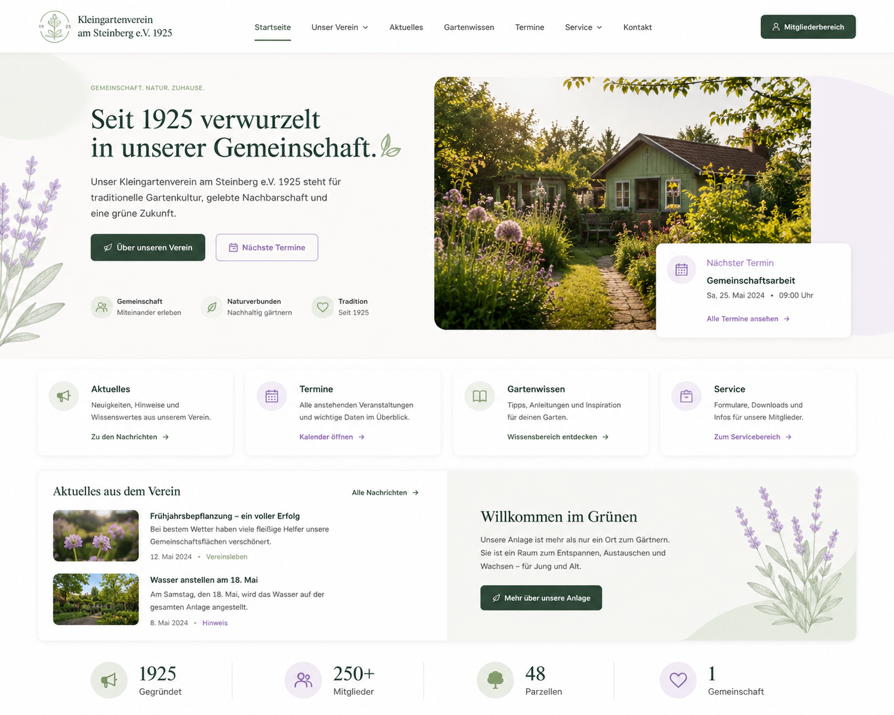
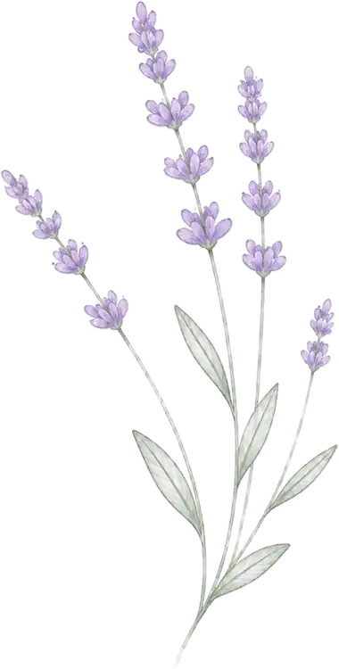

<div align="center">



# KGV1925 Website

**Kleingartenverein am Steinberg e.V. 1925**

Eine helle, barrierearme und moderne Vereinswebsite mit botanischem Designsystem, warmen Cremeflächen, Salbeigrün, Lavendel-Akzenten und klarer Informationsstruktur für Mitglieder, Interessierte und Besucher.

<br>



</div>

---

## Projektidee

Die Website des **Kleingartenverein am Steinberg e.V. 1925** soll mehr sein als eine klassische Vereinsseite. Sie bündelt Vereinsinformationen, macht Neuigkeiten sichtbar, stellt Termine zugänglich dar und gibt Besuchern einen hochwertigen ersten Eindruck des Vereins.

Im Fokus stehen eine ruhige Gestaltung, gute Lesbarkeit, klare Navigation, lokale Verarbeitung und eine langfristig wartbare technische Grundlage.

## Aktueller Projektstand

```txt
Status: Projektstart
Phase: Angular-Grundlage, SSR-Setup, lokales Asset-System und Designsystem
Priorität: App Shell, Startseite, Header, Footer, Basis-Komponenten
```

Die technische Basis ist als Angular-Projekt angelegt. Das visuelle Fundament liegt in `DESIGNSYSTEM.md` vor und bildet die Grundlage für die kommenden Komponenten.

## Designsystem

Das aktuelle Designsystem heißt **Bright Botanical Heritage**.

Es verbindet die Verlässlichkeit eines traditionsreichen Kleingartenvereins mit einer modernen, hellen und gut bedienbaren Oberfläche. Die Gestaltung soll natürlich und hochwertig wirken, aber nicht verspielt, rustikal oder überladen.

### Leitprinzipien

- Hell, ruhig und gut lesbar
- Naturinspiriert, aber strukturiert
- Modern, wartbar und performancebewusst
- Barrierearm für alle Generationen
- Lokale Assets und lokale Fonts
- Keine Cookies für unnötige Funktionen
- Keine externen Font-, Tracking- oder Drittanbieter-Dienste

<p align="center">
  
</p>

## Visuelle Richtung

Die Website nutzt eine warme botanische Designsprache:

- Creme- und Off-White-Flächen als helle Basis
- Salbeigrün als tragende Strukturfarbe
- Lavendel als weicher Akzent
- Sandtöne für saisonale Hinweise und dezente Hervorhebungen
- Klare Kontraste für gute Lesbarkeit
- Weiche Radien statt harter Kanten
- Dezente Schatten statt schwerer Effekte
- Großzügige Abstände und klare Inhaltsgruppen

Botanische Illustrationen werden sparsam eingesetzt. Sie unterstützen Atmosphäre und Wiedererkennung, dürfen aber Inhalte, Formulare oder wichtige Hinweise nicht überlagern.

## Design Tokens

Die zentralen Farben aus dem aktuellen Designsystem:

| Token | Wert | Verwendung |
| --- | --- | --- |
| `background` | `#fbfaf6` | Hauptfläche |
| `background-soft` | `#f6f3ee` | weiche Seitenbereiche |
| `surface` | `#ffffff` | Karten, Header, Modals |
| `surface-soft` | `#f8f6f1` | ruhige Content-Flächen |
| `surface-sage` | `#eef5ef` | Sektionen und Feature-Flächen |
| `surface-sage-strong` | `#dfeade` | stärkere Salbei-Flächen |
| `surface-lavender` | `#f3eff9` | weiche Akzentflächen |
| `surface-lavender-strong` | `#e8dff5` | stärkere Lavendel-Flächen |
| `text-main` | `#18211b` | Haupttext und Überschriften |
| `text-muted` | `#48534b` | sekundärer Text |
| `text-soft` | `#667267` | dezente Zusatzinformationen |
| `primary` | `#315c45` | primäre Aktionen und Navigation |
| `primary-hover` | `#244936` | Hover-Zustand primärer Aktionen |
| `secondary` | `#8f7bb8` | Lavendel-Akzente |
| `accent-sage` | `#a9bfa8` | unterstützende Salbei-Akzente |
| `accent-lavender` | `#c9b8e8` | dekorative Lavendel-Akzente |
| `accent-sand` | `#d8bc7a` | saisonale Hinweise |
| `border` | `#d8ded6` | Standardrahmen |
| `border-soft` | `#e8ece5` | dezente Trenner |
| `focus` | `#6f55a0` | sichtbarer Tastaturfokus |
| `success` | `#2f6f4e` | Erfolgsmeldungen |
| `warning` | `#8a6500` | Warnhinweise |
| `error` | `#b42318` | Fehlermeldungen |

### Typografie

Alle Schriften werden lokal eingebunden.

| Rolle | Font | Verwendung |
| --- | --- | --- |
| Display | Fraunces | Hero-Headlines, ausgewählte redaktionelle Überschriften |
| UI und Fließtext | Inter | Navigation, Bodytext, Karten, Buttons, Formulare |
| Icons | Material Symbols | einfache, unterstützende UI-Icons |

Fraunces wird zurückhaltend eingesetzt, damit die Website hochwertig und traditionsbewusst wirkt. Inter bleibt die funktionale Hauptschrift für gute Lesbarkeit.

### Formen, Schatten und Flächen

| Bereich | Vorgabe |
| --- | --- |
| Buttons | `0.625rem` Radius |
| Inputs | `0.625rem` Radius, sichtbarer Fokus |
| Karten | `1.25rem` Radius, weicher Rahmen, dezenter Schatten |
| Hero-Bilder | `1.75rem` Radius |
| Modals | `1.75rem` Radius, klarer Kontrast |
| Pills | `9999px` Radius |
| Standard-Schatten | `0 18px 48px rgba(24, 33, 27, 0.08)` |
| Hover-Schatten | `0 24px 64px rgba(24, 33, 27, 0.12)` |

## Technische Grundlage

| Bereich | Technologie |
| --- | --- |
| Frontend | Angular |
| Rendering | Angular SSR |
| Styling | SCSS |
| Routing | Angular Router |
| Assets | lokale Bilder und lokale Fonts |
| Icons | lokale Material Symbols |
| Backend geplant | Django REST Framework |
| Datenbank geplant | PostgreSQL |
| Background Jobs geplant | Celery und Redis |

## Projektziele

- Repräsentative Website für den Verein
- News zentral veröffentlichen
- Termine und Veranstaltungen übersichtlich darstellen
- Vereinshaus-Vermietung per Online-Formular vorbereiten
- Gartenansichten und Vereinsleben hochwertig präsentieren
- Accessibility-Modus von Beginn an berücksichtigen
- SEO sauber vorbereiten
- Responsive Layouts bis 320 px Viewport-Breite
- Gute Print-Ausgabe für relevante Inhalte
- Keine unnötigen Cookies
- Keine externen Tracking-, Font- oder Drittanbieter-Dienste
- Gute Performance auf Desktop, Tablet und Mobile

## Geplante Hauptbereiche

```txt
Startseite
├── Verein
├── Aktuelles
├── Termine
├── Gärten
├── Vereinshaus
├── Service
├── Kontakt
└── Mitgliederbereich
```

Der Mitgliederbereich hat zunächst geringe Priorität und wird später erweitert.

## Aktuelle Asset-Struktur

Die README-Verknüpfungen wurden an die tatsächlich vorhandenen Dateien im Projekt angepasst.

```txt
public/
└── favicon.ico

src/assets/
├── fonts/
│   ├── license/
│   │   ├── OFL.txt
│   │   └── README.txt
│   ├── Fraunces-VariableFont_SOFT,WONK,opsz,wght.ttf
│   ├── inter-variable.ttf
│   └── material-symbols-outlined-latin-fill-normal.woff2
└── img/
    ├── Entwurf/
    │   └── Entwurf-Startseite.png
    ├── KGV1925_Logo.webp
    ├── lavendel-1_aquarell.webp
    ├── lavendel-2_aquarell.webp
    ├── lavendel-3_aquarell.webp
    └── lavendel-4_aquarell.webp
```

### Verwendete README-Bilder

| Zweck | Datei |
| --- | --- |
| Logo | `src/assets/img/KGV1925_Logo.webp` |
| Dekoration oben | `src/assets/img/lavendel-1_aquarell.webp` |
| Designsystem-Akzent | `src/assets/img/lavendel-2_aquarell.webp` |
| Startseiten-Entwurf | `src/assets/img/Entwurf/Entwurf-Startseite.png` |
| Footer-Dekoration | `src/assets/img/lavendel-4_aquarell.webp` |

<p align="center">
  
</p>

## Entwicklung starten

Repository installieren:

```bash
npm install
```

Lokalen Entwicklungsserver starten:

```bash
npm start
```

Anschließend im Browser öffnen:

```txt
http://localhost:4200
```

## Angular CLI

Komponente erzeugen:

```bash
npx ng generate component components/example
```

Build erstellen:

```bash
npx ng build
```

Tests ausführen:

```bash
npx ng test
```

SSR-Build lokal starten:

```bash
npm run build
npm run serve:ssr:kgv1925
```

## Entwicklungsregeln

- Quellcode bleibt verständlich, wartbar und nachvollziehbar
- TypeScript-Dateien beginnen mit der Pfadangabe als Blockkommentar
- TypeScript-Kommentare werden im JSDoc-Format geschrieben
- SCSS enthält keine Inline-Kommentare
- SCSS-Dateien erhalten keine Pfadangabe am Dateianfang
- Neue Dateien werden mit CRLF gespeichert
- Dateien werden logisch nach Feature und Funktion strukturiert
- Assets werden lokal eingebunden
- Fonts werden lokal ausgeliefert
- Keine externen Font-CDNs
- Keine unnötigen Drittanbieter-Dienste
- Nach abgeschlossenen Kernfeatures wird direkt committet

## Accessibility

Barrierefreiheit wird direkt mitentwickelt.

Wichtige Grundlagen:

- semantisches HTML
- sichtbare Fokuszustände
- ausreichende Kontraste
- große Touch-Flächen
- verständliche Linktexte
- reduzierte Bewegung bei `prefers-reduced-motion`
- gute Lesbarkeit bis 320 px Viewport-Breite
- sinnvolle Alternativtexte für relevante Bilder
- keine Informationen ausschließlich über Farbe
- Formulare mit sichtbaren Labels und verständlichen Fehlermeldungen

## Performance

Die Website soll leichtgewichtig bleiben.

Dazu gehören:

- optimierte WebP- oder AVIF-Bilder
- lokale Schriften
- kleine wiederverwendbare Komponenten
- keine unnötigen Animationen
- keine teuren Blur-Effekte
- kein Tracking
- keine externen Font-CDNs
- klare SCSS-Struktur
- responsive Bilder und sparsame dekorative Assets

## Empfohlene Komponenten-Reihenfolge

```txt
App Shell
├── Header
├── Footer
├── Button
├── Card
├── Section Wrapper
├── Feature Card
├── News Teaser
├── Event Teaser
└── Accessible Form Field
```

## Commit-Konvention

Commits werden auf Englisch geschrieben.

Beispiele:

```bash
git commit -m "feature(app-shell): initialize Angular layout"
git commit -m "feature(home): add botanical hero section"
git commit -m "fix(header): improve mobile navigation contrast"
git commit -m "docs(readme): update asset links and design system"
```

Erlaubte Prefixe:

```txt
docs
fix
feature
refactor
```

---

<div align="center">



**KGV1925 Website**  
Bright Botanical Heritage für eine moderne Vereinswebsite.

</div>
